  <h1>松坂ユキ / Matsuzaka Yuki</h1>
  <a href="#chinese">简体中文</a> · <a href="#japanese">日本語</a>

---

## 关于我 🖖

+ 我叫**松坂ユキ**（Matsuzaka Yuki）。
+ 一名热爱编程的**学生**，目前正在不断学习和探索技术的世界。
+ 在我的 GitHub 上，你会看到各种编程项目和个人练习，涵盖**前端、后端和全栈**方向。
+ 课余时间我喜欢**日本动漫、轻小说**，也喜欢听**日语歌曲**。
+ 日常开发使用 **Windows** 系统。

## 正在学习 🤔

+ 正在深入学习 **JavaScript / TypeScript**，夯实前端基础。
+ 学习 **Node.js** 后端开发，构建全栈应用。
+ 探索 **Java / Kotlin**，拓展编程语言技能树。
+ 学习使用 **Python** 进行数据处理和自动化脚本编写。
+ 研究 **AstroJS**，构建高性能的静态网站。
+ 持续学习 **MySQL / MongoDB** 等数据库技术。

## 技术栈

### Front-End

  
  
  
  
  

### Back-End

  
  
  
  

### Database

  
  

### Tools

  
  

---

## 私について 🖖

+ **松坂ユキ**（Matsuzaka Yuki）と申します。
+ プログラミングが大好きな**学生**です。現在、技術の世界を常に学び、探求しています。
+ GitHub には、**フロントエンド・バックエンド・フルスタック**に関する様々なプロジェクトや個人開発の成果を公開しています。
+ 趣味は**日本のアニメ・ライトノベル**の鑑賞と、**日本語の音楽**を聴くことです。
+ 開発環境は **Windows** を使用しています。

## 今勉強していること 🤔

+ **JavaScript / TypeScript** を深く学び、フロントエンドの基礎を固めています。
+ **Node.js** でバックエンド開発を学び、フルスタックアプリを構築しています。
+ **Java / Kotlin** を探求し、プログラミング言語のスキルを広げています。
+ **Python** を使ったデータ処理や自動化スクリプトの作成を学んでいます。
+ **AstroJS** を研究し、高性能な静的サイトを構築しています。
+ **MySQL / MongoDB** などのデータベース技術を継続的に学習しています。

## 技術スタック

### Front-End

  
  
  
  
  

### Back-End

  
  
  
  

### Database

  
  

### Tools

  
  

---

## GitHub 统计 / GitHub スタッツ

