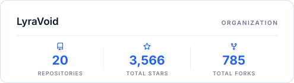
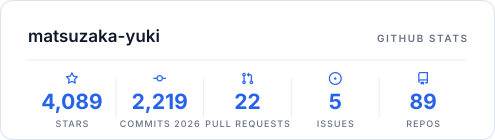
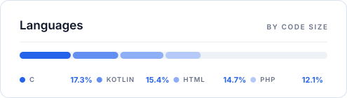

# Matsuzaka Yuki

松坂ユキ

**Student Developer · Web & Backend Engineering**

[GitHub](https://github.com/matsuzaka-yuki) · [Tech Stack](#tech-stack) · [Organization](#organization) · [Statistics](#statistics) · [Contact](#contact)

---

## Summary

I am a student developer working mainly in TypeScript and Node.js, with a growing
interest in backend services and static site generation. My primary development
environment is **Arch Linux**, and I am steadily extending my skill set across the
wider web stack.

Outside of engineering I follow Japanese animation, light novels, and Japanese
music, an interest that keeps me attentive to visual design and editorial quality
in the projects I build.

I favor straightforward, maintainable implementations over clever ones, and I aim
to write software that other people can read, run, and extend without difficulty.

 

---

## Tech Stack

| Area | Technologies |
| --- | --- |
| Languages | TypeScript · JavaScript · Python · Java · Kotlin |
| Runtime & Frameworks | Node.js · Astro |
| Data | MySQL · MongoDB |
| Environment & Tooling | Arch Linux · Git · Neovim · VS Code |

---

## Organization

I am an administrator of [**LyraVoid**](https://github.com/LyraVoid), an open-source
organization working on Astro-based blog themes and Android root and module tooling.

  <picture>
    <source media="(prefers-color-scheme: dark)" srcset="profile/org-stats-dark.svg">
    
  </picture>

---

## Statistics

  <picture>
    <source media="(prefers-color-scheme: dark)" srcset="profile/stats-dark.svg">
    
  </picture>
   
  <picture>
    <source media="(prefers-color-scheme: dark)" srcset="profile/top-langs-dark.svg">
    
  </picture>

---

## Contact

 

  Always learning. Always building.

